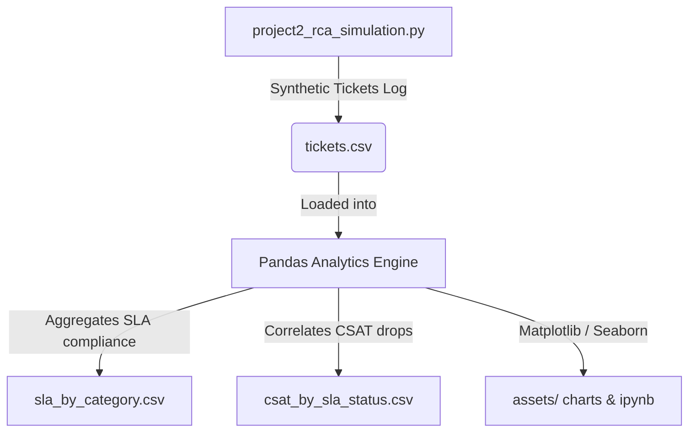

# 🛠️ Operational SLA Bottleneck Analysis & Incident Responder

[](https://enterprise-analytics-portfolio-nsbdpzsq8qyra3tqxs7swa.streamlit.app/)
[](project2_rca_simulation.py)
[](#)
[](project2_operations_sla_rca.ipynb)
[](#)

---

## 🌐 Live Interactive Application
👉 **[Launch Live Streamlit Dashboard](https://enterprise-analytics-portfolio-nsbdpzsq8qyra3tqxs7swa.streamlit.app/)**

## 📖 Project Overview & Notebook Link
This project features an interactive **[Jupyter Notebook (project2_operations_sla_rca.ipynb)](project2_operations_sla_rca.ipynb)** showing the live execution, results, and visualizations. 

### Data & Process Flow


---

## Why I Built This Project (Personal Context)

Having spent a lot of time in high-volume customer support operations, I know exactly how stressful it is when SLA compliance metrics slip. The dashboards turn red, and leadership wants immediate answers. But relying on a single, overall compliance score (like "80% met") is incredibly frustrating because it doesn't tell you *which* queue is failing or *why*. 

I built this project to simulate how I audit support ticket queues. I generated a synthetic dataset of 1,000 service tickets with priority levels, timestamps, CSAT ratings, and SLA targets. I wanted to:
1. Isolate the exact categories causing the majority of SLA breaches.
2. Quantify how SLA misses directly affect customer satisfaction (CSAT).
3. Design a warning trigger system that lets managers intervene *before* a ticket breaches.

## My Approach (How I Solved It)

I wanted to keep the analysis practical for an operations team, so I focused on bottlenecks and customer sentiment.

1. **SLA Compliance Auditing:** I parsed timestamps in Python using Pandas to calculate the exact resolution turnaround time (TAT) and flagged SLA compliance against target windows.
2. **Bottleneck RCA (Pareto):** I sorted categories by their breach counts and plotted a cumulative distribution. I wanted to see if the "80/20 rule" applied to our ticket backlog.
3. **CSAT Sentiment Impact:** I grouped CSAT scores by SLA status (Met vs. Breached) across categories to calculate the direct statistical impact of delays on customer ratings.
4. **Queue Warnings:** I designed a blueprint for milestone alerts (escalating tickets at 50% and 75% of the SLA window) to move the team from firefighting to prevention.

## KPIs

- SLA compliance rate (%)
- Average handling time (AHT) in hours
- Ticket volume by category
- SLA breach rate by category
- Average customer satisfaction score (CSAT)

## Findings

- Total Tickets Received: **1,000**
- Resolved Tickets: **688** (68.8% Resolution Rate)
- Overall SLA Compliance: **80.67%** (against a target of 90%)
- Primary Bottleneck: **Delivery Issue** requests
  - SLA Breach Rate: **40.7%**
  - Average Handling Time: **71.33 hours** against a 72-hour SLA target
- CSAT Sentiment Impact:
  - Tickets resolved within SLA: **3.98 / 5.0**
  - Tickets that breached SLA: **1.44 / 5.0** (Delta drop of **2.54 points**)

### Visualizations

#### 1. SLA Breaches by Category (Pareto Analysis)
This chart illustrates the count of breaches by category in descending order, with a cumulative percentage line. Delivery Issue and Technical Support account for the vast majority of breaches.


#### 2. CSAT Comparison: SLA Met vs. Breached
This side-by-side comparison shows the drop in customer satisfaction when a ticket breaches the SLA target across different request categories.


#### 3. Ticket Volume and SLA Performance over Time
This stacked bar chart shows the monthly volume of tickets received, broken down by performance status (Resolved within SLA, Resolved with Breaches, or Open/In Progress).


## Recommendation

- **Redesign Delivery Issue Workflow**: Restructure the standard operating procedures for delivery issue escalations first to bring average handling time well below the 72-hour target.
- **Implement Milestone Escalations**: Configure 50% and 75% alerts in the CRM queue for high-priority tickets to allow intervention before breaches occur.
- **Category-level Reporting**: Shift executive reports from a single overall SLA rate to category-specific breach tracking.

## Outcome

This analysis narrowed a general operational compliance issue to a single bottleneck workflow and quantified the CSAT risk of SLA breaches, supporting an action plan.

## Turning the analysis into a working tool

The notebook above tells you what already went wrong. I wanted to go a step further and build something that catches a ticket before it breaches, not after.

`app.py` is a Streamlit dashboard that reads the same ticket data, flags anything running past 75% of its SLA window, and gives a support manager two things to do about it:

1. **Send an immediate first response.** A fixed acknowledgment email goes out right away, no AI involved, just confirming the ticket was received and someone's on it.
2. **Draft a resolution update with Gemini.** Once someone's actually worked the ticket, the app can generate a short status update using the ticket's real details (category, priority, how far past SLA it is). Nothing sends until a human reviews and approves it.

I split it this way on purpose. The first response doesn't need judgment, it just needs to go out fast and consistently, so there's no reason to involve an LLM or a person. The follow-up update is where the actual case-specific reasoning matters, so that's where I put the AI and a human approval step.

**To run it locally:**

```
pip install -r ../requirements.txt
streamlit run app.py
```

You'll need a Gemini API key (free tier from Google AI Studio) pasted into the sidebar to generate resolution drafts. The ticket data regenerates automatically on first run if it isn't already present.
```

