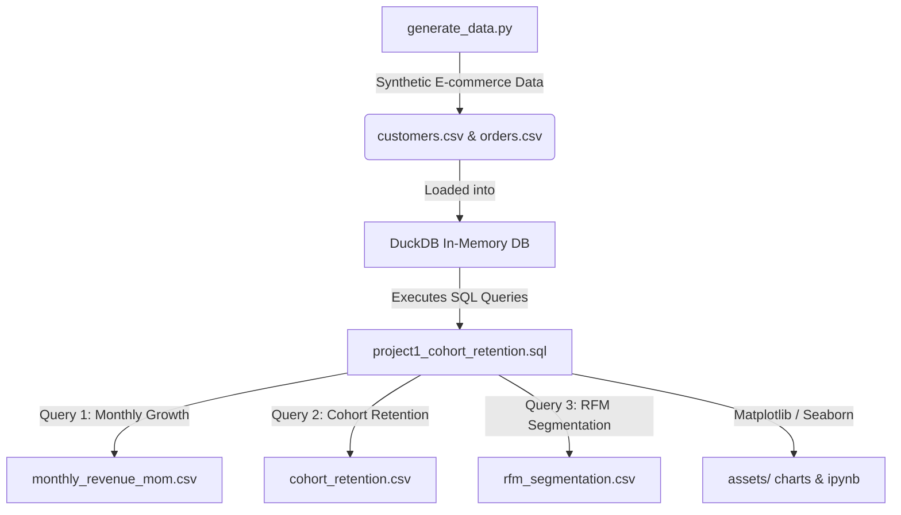
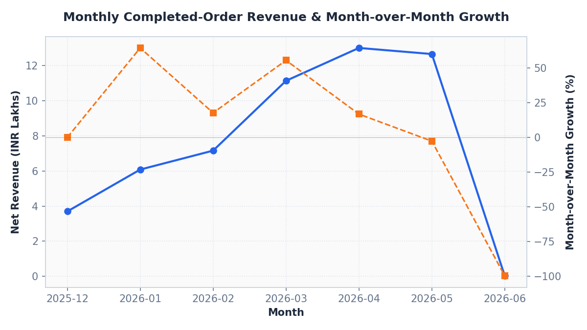
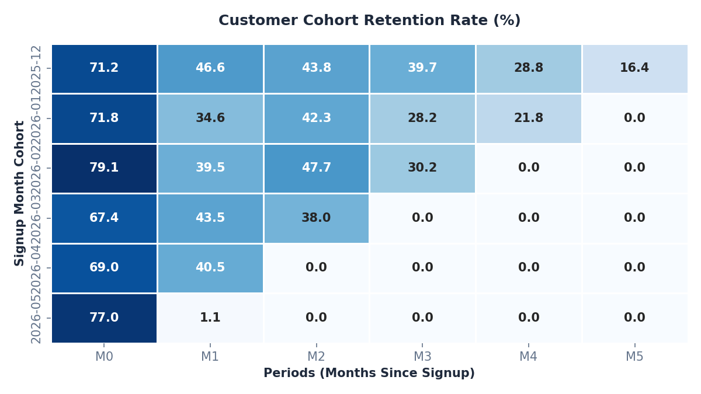
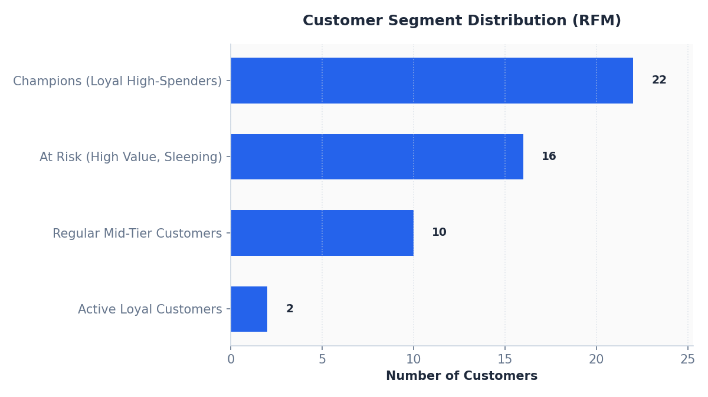

# 📊 Customer Revenue, Retention, and RFM Analysis

---

## 📖 Project Overview & Notebook Link
This project features an interactive **[Jupyter Notebook (project1_cohort_rfm_analysis.ipynb)](project1_cohort_rfm_analysis.ipynb)** showing the live execution, results, and visualizations. 

### Data & Process Flow

---

## Why I Built This Project (Personal Context)

When I worked in digital campaign reporting, I saw how easily teams got excited about raw transaction totals. But aggregate sales numbers can hide serious retention decay under the surface. I wanted to see if I could write a clean, efficient SQL script to solve this. 

I generated a synthetic database of 500 customers and 929 orders to mimic typical transaction tables. My goals were to find out:
1. Is our net revenue actually growing month-over-month (MoM)?
2. How bad is our order return rate?
3. In which month after signup do we lose most of our customers (cohort retention)?
4. Who are our highest-value customers, and which ones are at risk of leaving?

## My Approach (How I Solved It)

I wanted to make sure my logic was 100% clean, so I started by filtering out returned orders so we didn't artificially inflate our revenue numbers. 

1. **Revenue Growth:** I used SQL CTEs to group sales by month, and then used the `LAG()` window function to pull the prior month's revenue to calculate the MoM growth percentage.
2. **Cohort Retention:** I grouped customers by their signup month, then calculated the month difference for each order relative to that signup month, building a monthly cohort matrix.
3. **RFM Segmentation:** I ranked customers based on their last purchase date (Recency), order frequency, and total spend (Monetary) using the `NTILE(5)` window function. I made sure to verify that a score of '555' really represented our best champions before categorizing them.

## KPIs

- Completed-order revenue
- Completed orders
- Month-over-month revenue growth
- Return rate
- Active purchasing customers
- Repeat customer rate
- Cohort retention
- Recency, frequency, and monetary value

## Findings

- Completed-order revenue: **INR 5,372,250**
- Completed orders: **887**
- Active purchasing customers: **395**
- Repeat purchasers: **249**
- Repeat purchaser share: **63.0% of active customers**
- Return rate: **4.5% of orders**

### Visualizations

#### 1. Monthly Revenue Trend & Month-over-Month Growth
This chart displays the net revenue trend along with MoM growth percentage. We notice a steady growth peak in April 2026, followed by a slight drop in May.

#### 2. Cohort Retention Heatmap
This heatmap illustrates the percentage of customers in each monthly cohort who return to purchase in subsequent months. Period 0 is the signup month. We observe that retention drops off significantly by Month 1 and continues to decline.

#### 3. RFM Customer Segment Distribution
This chart segments the active customer base into actionable priority groups based on their purchasing recency, frequency, and monetary value scores.

## Recommendation

- Protect high-value customers whose recency is deteriorating with targeted retention activity.
- Build onboarding campaigns around the cohort periods where repeat activity begins to weaken.
- Track returns by category and product before using revenue alone to assess performance.
- Add acquisition channel and margin data to compare customer quality, not only customer volume.

## Outcome

This project produced a reusable SQL framework that converts transactional data into customer lifecycle decisions. It does not claim that a campaign was implemented; the outcome is the analytical segmentation and decision framework.

