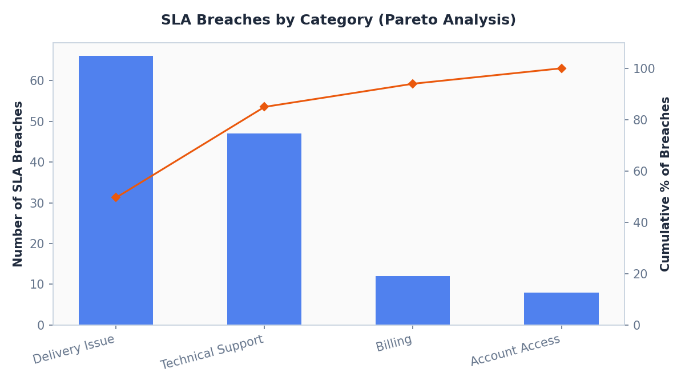
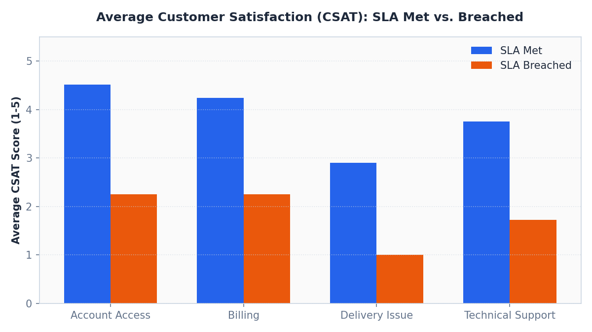
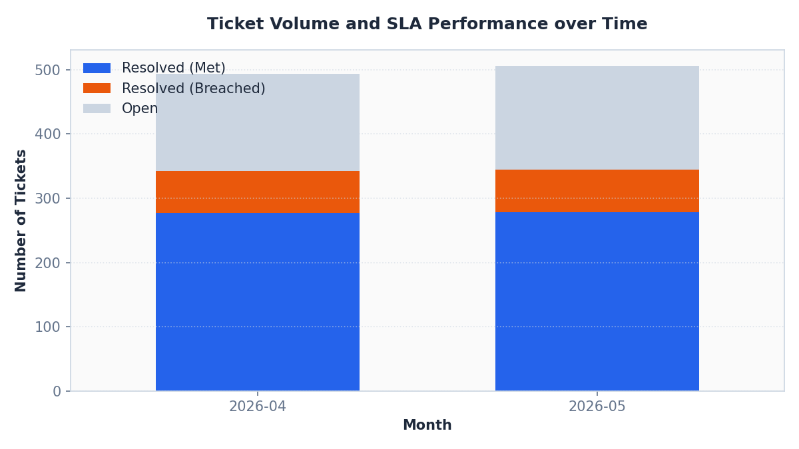

# Operational SLA Bottleneck Analysis

## Business Context

An operations leadership team needs to identify what is driving service SLA misses and where they should intervene to improve customer satisfaction (CSAT). Relying on a single aggregate SLA compliance score hides specific bottlenecks and process failures.

## Business Questions

1. What is the overall SLA compliance rate and ticket resolution rate?
2. Which support categories drive the majority of SLA breaches?
3. How do SLA breaches affect customer satisfaction scores?
4. What is the recommended operational action plan?

## Dataset

- 1,000 synthetic service tickets
- Ticket attributes: ID, category, priority, status, created_at, resolved_at, SLA target, handling time, breach status, CSAT score.

*Note: All data is synthetic, generated by the included script for portfolio practice only.*

## My Approach

1. Cleaned and formatted timestamps and handling times.
2. Grouped tickets by category and priority to calculate average handling time and breach rate.
3. Created a Pareto cumulative distribution to identify the top categories causing breaches.
4. Calculated the correlation between SLA breaches and customer satisfaction ratings.
5. Structured a milestone-based warning specification and queue governance model.

## KPIs

- SLA compliance rate (%)
- Average handling time (AHT) in hours
- Ticket volume by category
- SLA breach rate by category
- Average customer satisfaction score (CSAT)

## Findings

- Total Tickets Received: **1,000**
- Resolved Tickets: **688** (68.8% Resolution Rate)
- Overall SLA Compliance: **80.67%** (against a target of 90%)
- Primary Bottleneck: **Delivery Issue** requests
  - SLA Breach Rate: **40.7%**
  - Average Handling Time: **71.33 hours** against a 72-hour SLA target
- CSAT Sentiment Impact:
  - Tickets resolved within SLA: **3.98 / 5.0**
  - Tickets that breached SLA: **1.44 / 5.0** (Delta drop of **2.54 points**)

### Visualizations

#### 1. SLA Breaches by Category (Pareto Analysis)
This chart illustrates the count of breaches by category in descending order, with a cumulative percentage line. Delivery Issue and Technical Support account for the vast majority of breaches.


#### 2. CSAT Comparison: SLA Met vs. Breached
This side-by-side comparison shows the drop in customer satisfaction when a ticket breaches the SLA target across different request categories.


#### 3. Ticket Volume and SLA Performance over Time
This stacked bar chart shows the monthly volume of tickets received, broken down by performance status (Resolved within SLA, Resolved with Breaches, or Open/In Progress).


## Recommendation

- **Redesign Delivery Issue Workflow**: Restructure the standard operating procedures for delivery issue escalations first to bring average handling time well below the 72-hour target.
- **Implement Milestone Escalations**: Configure 50% and 75% alerts in the CRM queue for high-priority tickets to allow intervention before breaches occur.
- **Category-level Reporting**: Shift executive reports from a single overall SLA rate to category-specific breach tracking.

## Outcome

This analysis narrowed a general operational compliance issue to a single bottleneck workflow and quantified the CSAT risk of SLA breaches, supporting an action plan.

## How to Run

1. Install the required dependencies:
   ```bash
   pip install -r ../requirements.txt
   ```
2. Generate the synthetic data, run the analysis, and save charts:
   ```bash
   python3 project2_rca_simulation.py
   ```
   This will output the operational metrics report to the terminal, save the summary tables as CSVs in the `outputs/` folder, and save the charts as PNGs in the `assets/` folder.
