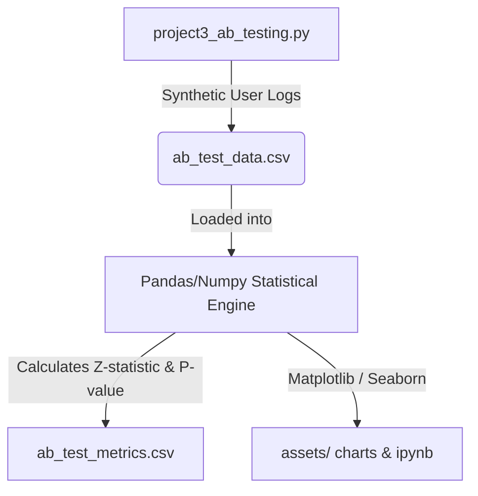
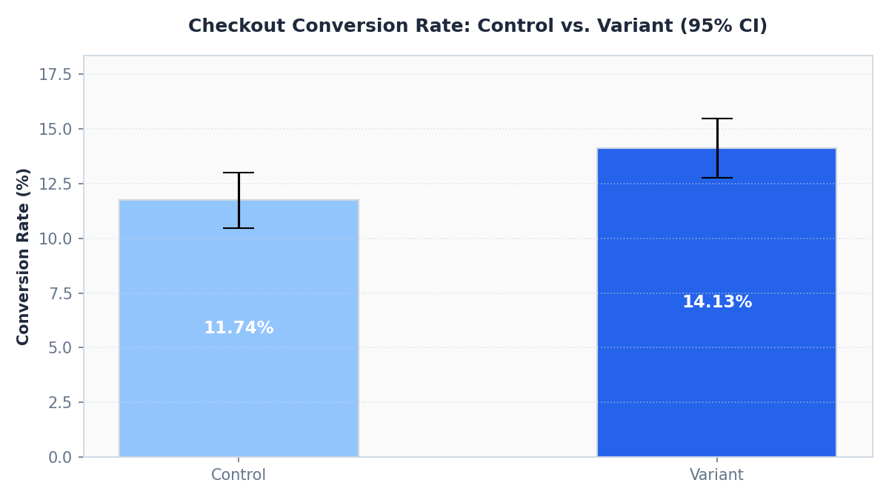
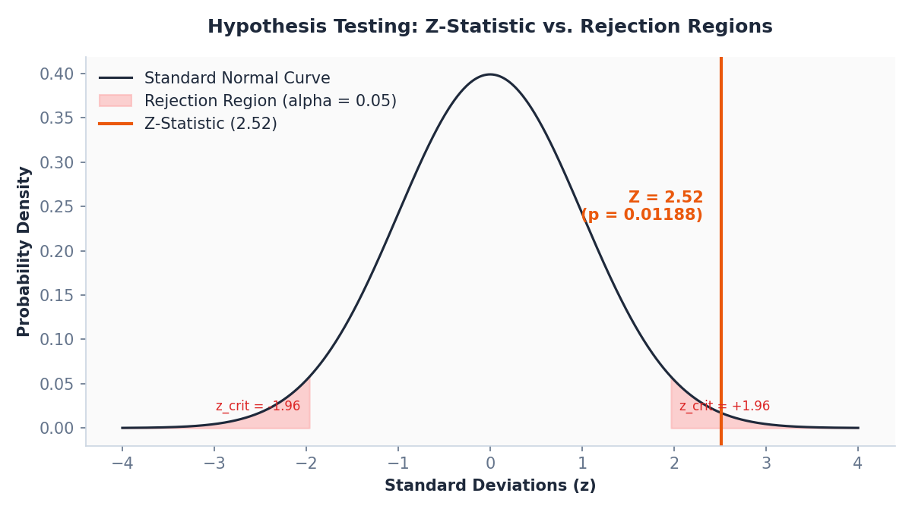

# 🧪 Product Conversion Funnel A/B Testing

[](project3_ab_testing.py)
[](#)
[](project3_checkout_ab_test.ipynb)
[](#)

---

## 📖 Project Overview & Notebook Link
This project features an interactive **[Jupyter Notebook (project3_checkout_ab_test.ipynb)](project3_checkout_ab_test.ipynb)** showing the live execution, results, and visualizations. 

### Data & Process Flow


---

## Why I Built This Project (Personal Context)

In product operations, everyone has an opinion on which UI design looks best or which layout is "easier" for users. But gut feelings can lead to expensive mistakes if a checkout redesign actually breaks the conversion flow. I wanted to build a statistical analysis tool that takes the guesswork out of product releases. 

I simulated an experiment with 5,000 users split between a Control group (current checkout flow) and a Variant group (new checkout flow). I wanted to see if the new layout actually improved conversion, or if the variance was just random noise. My goals were to:
1. Formulate and calculate a proper two-proportion Z-test from scratch in Python.
2. Determine if the difference in conversion is statistically significant ($p < 0.05$).
3. Calculate the 95% Confidence Interval to give leadership a reliable range of expected conversion lift.

## My Approach (How I Solved It)

I avoided high-level black-box libraries and coded the statistical calculations from scratch to demonstrate my understanding of the math.

1. **Null vs. Alternative Formulation:** I set the Null Hypothesis ($H_0$) as conversion rates being equal (no real change), and the Alternative Hypothesis ($H_a$) as the variant flow having a higher conversion rate.
2. **Proportion and Standard Error Calculation:** I calculated the group conversion rates, pooled conversion rate, and standard error of the difference.
3. **Z-Test & P-Value:** I wrote the formulas to output the Z-statistic and mapped it to a standard normal curve to compute the two-tailed P-value.
4. **Confidence Interval (CI):** I calculated the 95% confidence margin to estimate the true lift range.

## KPIs

- Conversion rate (CR)
- Absolute conversion rate lift
- Relative conversion rate lift
- Z-statistic
- P-value
- 95% Confidence Interval (CI)

## Findings

- Control Group (Current Flow): **n = 2,495** | Conversions = **293** | Conversion Rate = **11.74%**
- Variant Group (New Checkout): **n = 2,505** | Conversions = **354** | Conversion Rate = **14.13%**
- Observed Conversion Rate Lift: **+2.39%** absolute (relative lift of **+20.35%**)
- 95% Confidence Interval (CI): **[+0.53% to +4.25%]**
- Calculated Z-Statistic: **2.5157**
- Calculated P-Value: **0.01188** (statistically significant at $\alpha = 0.05$)

### Visualizations

#### 1. Conversion Rate Comparison (Control vs. Variant)
This bar chart displays the conversion rates for each group with 95% confidence interval error bars. There is a clear, non-overlapping gap indicating a solid lift.


#### 2. Hypothesis Testing: Z-Statistic vs. Rejection Regions
This normal curve shows where our calculated Z-statistic ($Z = 2.52$) falls relative to the standard rejection regions ($\alpha = 0.05$, $z_{crit} = \pm 1.96$). Because the Z-statistic lies in the right rejection region, we reject the null hypothesis.


## Recommendation

- **Proceed with Rollout**: Because the conversion rate lift is statistically significant ($p = 0.01188 < 0.05$), proceed with rolling out the new checkout flow.
- **Implement a Staged Release**: Expose the new flow to 25% of traffic initially, monitoring errors and page load times by device before going to 100%.
- **Track Secondary Guardrail Metrics**: Ensure that average order value (AOV) and return rates are not negatively affected by the new checkout.

## Outcome

The experiment provided statistically supported evidence in favor of the variant, allowing product leadership to make an evidence-based rollout decision.

## How to Run

1. Install the required dependencies:
   ```bash
   pip install -r ../requirements.txt
   ```
2. Run the simulation and analysis:
   ```bash
   python3 project3_ab_testing.py
   ```
   This will output the experiment scorecard to the terminal, save the metrics summary as a CSV in `outputs/`, and save the visualizations as PNGs in `assets/`.
