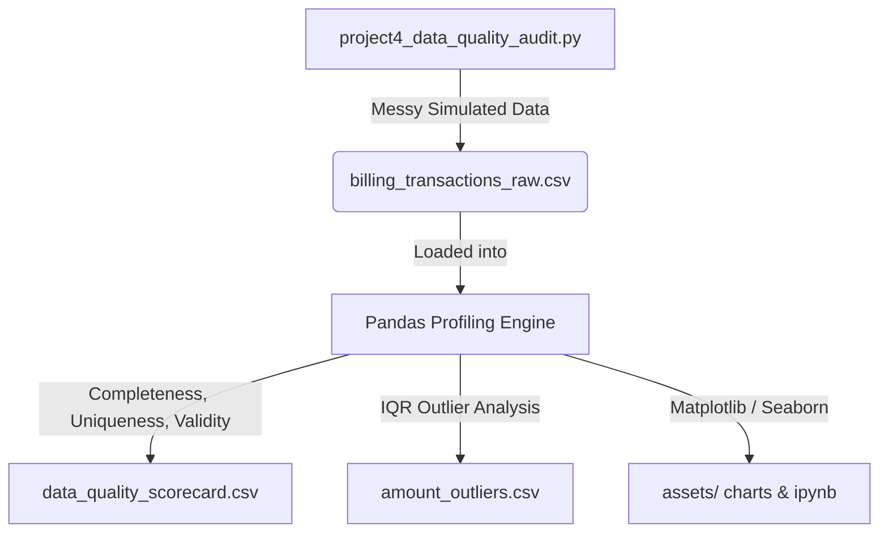
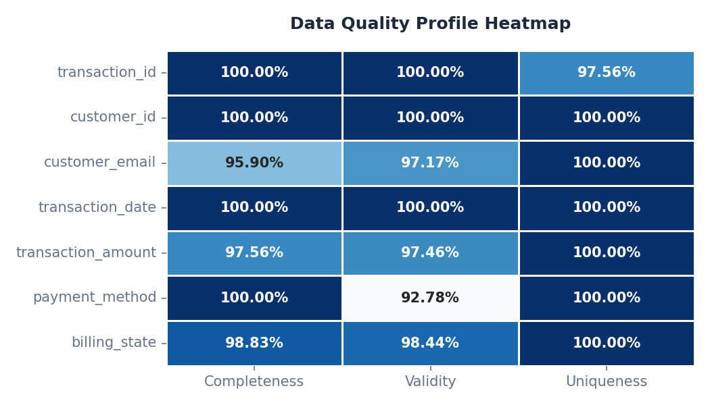
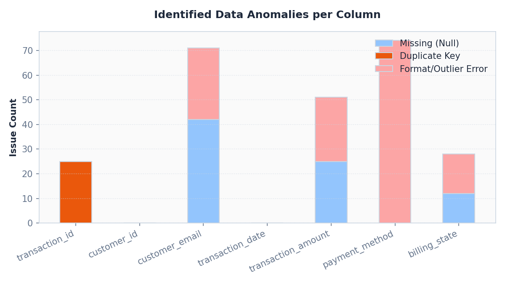
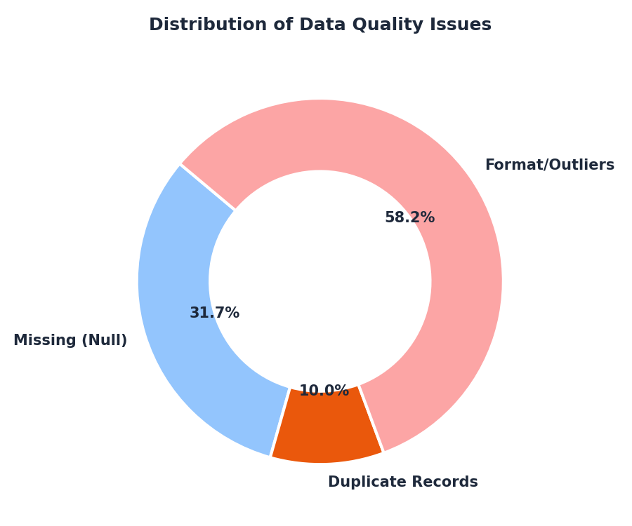

# 🧼 Data Quality Audit & Profiling

[](project4_data_quality_audit.py)
[](#)
[](project4_data_quality_audit.ipynb)
[](#)

---

## 📖 Project Overview & Notebook Link
This project features an interactive **[Jupyter Notebook (project4_data_quality_audit.ipynb)](project4_data_quality_audit.ipynb)** showing the live execution, results, and visualizations. 

### Data & Process Flow


---

## Why I Built This Project (Personal Context)

Anyone who has ever built a dashboard knows the pain of having a visualization break or show ridiculous numbers because of messy data. At Deloitte and MediaMint, I spent a lot of time cleaning database files because of simple input errors like inconsistent casing (e.g. `cc` vs `Credit Card`) or missing fields. I was tired of manually correcting sheets and wanted to build a Python automation script that programmatically profiles data health.

I generated a synthetic billing dataset of 1,025 transaction logs, intentionally seeding it with typical real-world errors (nulls, duplicates, format violations, and outlier amounts). My goals were to:
1. Programmatically score the data on Completeness, Uniqueness, and Validity.
2. Isolate transaction outliers and duplicate transaction IDs.
3. Establish a clear, structured blueprint of schema constraints to prevent dirty data from reaching downstream tables.

## My Approach (How I Solved It)

I designed a systematic data quality audit script using Pandas to evaluate columns across four dimensions.

1. **Completeness Profiling:** I checked for nulls, empty cells, and whitespace values in each field relative to total records.
2. **Uniqueness Profiling:** I searched for duplicate primary keys (`transaction_id`) to estimate transaction replication rates.
3. **Validity Profiling:** I verified emails using pattern matching, payment methods using strict keyword matches, and state codes against standard uppercase abbreviations.
4. **Outlier Detection:** I calculated the statistical boundaries using the Interquartile Range (IQR) method ($1.5 \times \text{IQR}$) to detect amount discrepancies.

## KPIs

- Completeness Score (% non-null)
- Uniqueness Score (% unique keys)
- Validity Score (% conforming to format rules)
- Total anomalous record counts

## Findings

- **Total Rows Audited**: 1,025
- **Unique Transactions**: 1,000 (25 duplicate rows detected, yielding a 97.56% uniqueness rate on keys)
- **Completeness Metrics**:
  - Missing Emails: **42 records** (95.90% completeness)
  - Missing Amounts: **25 records** (97.56% completeness)
  - Missing States: **12 records** (98.83% completeness)
- **Validity & Format Violations**:
  - Inconsistent Payment Method casing/labels: **74 records** (92.78% validity rate)
  - Invalid Email formats: **29 records** (97.17% validity rate)
  - Out-of-bounds State codes: **16 records** (98.44% validity rate)
  - Transaction Amount violations (Negative/Extreme Outliers): **26 records** (97.46% validity rate)

### Visualizations

#### 1. Data Quality Profile Heatmap
This heatmap illustrates the percentage scores for completeness, uniqueness, and validity across all checked columns. It immediately highlights that `payment_method` has the lowest validity (due to casing inconsistencies) and `customer_email` has the lowest completeness.


#### 2. Identified Data Anomalies per Column
This stacked bar chart breaks down the raw count of errors by type (Missing, Duplicate, or Format/Outlier Error) for each column.


#### 3. Distribution of Data Quality Issues
This donut chart summarizes the share of issue categories across the entire dataset, indicating that missing values represent the largest portion of quality issues.


## Recommendation

- **Implement Input Field Validation**: Restrict frontend inputs on payment methods to a drop-down select element to eliminate casing variations (e.g. `cc` vs `Credit Card`).
- **Enforce Database Schema Integrity**: Set `NOT NULL` constraints on critical fields like `customer_email` and `transaction_amount`, and add a unique primary key constraint on `transaction_id` to block duplicate uploads.
- **Set Up Real-time Data Quality Checks**: Schedule a nightly SQL profiling script that alerts data engineers when any completeness or validity score drops below 99%.
- **Outlier Cleaning**: Quarantining transactions with negative amounts or amounts exceeding 3x the Interquartile Range (IQR) for manual verification before sending to financial dashboards.

## Outcome

This audit provided a clear quantification of the database's structural data issues, laying out the groundwork for engineering updates that will restore report credibility.

## How to Run

1. Install the required dependencies:
   ```bash
   pip install -r ../requirements.txt
   ```
2. Run the data quality audit and generate visualizations:
   ```bash
   python3 project4_data_quality_audit.py
   ```
   This will output the quality scorecard to the terminal, save the metrics and outliers as CSVs in `outputs/`, and save the visualizations in `assets/`.

*Data is synthetic, generated by the included script.*
