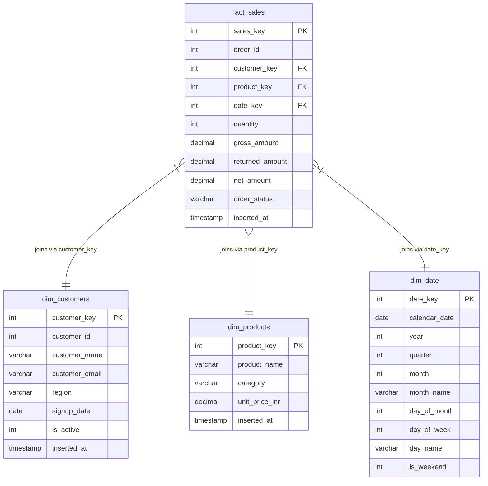

# 🗄️ Enterprise Data Warehouse Star Schema & ETL Pipeline

[](etl_pipeline.py)
[](warehouse_schema.sql)
[](#)
[](#)

---

## Why I Built This Project (Personal Context)

As a Business/Data Analyst, I frequently work with raw, transactional logs that are highly normalized, containing duplicates, formatting discrepancies, and casing variations. Querying these files directly is inefficient and increases report query runtimes. 

I designed this project to show how we can build a proper **Star Schema Data Warehouse** and construct an automated **ETL Pipeline** to transform transactional source files (`customers.csv` and `orders.csv`) into structured, clean facts and dimensions inside a **DuckDB** analytics database (`analytics_warehouse.db`).

---

## 📐 Data Warehouse Model: Star Schema

To facilitate fast aggregation and simple reporting joins, the schema is organized into one central **Fact Table** (`fact_sales`) and three surrounding **Dimension Tables**:

### Star Schema Relationships


---

## ⚙️ ETL Pipeline Flow (etl_pipeline.py)

The Python ETL script operates across three classical stages:

```
[ EXTRACT ]    --->   Read raw e-commerce CSV source logs (customers, orders)
                             |
                             v
[ TRANSFORM ]  --->   1. Clean customer names (Title Case) & emails (lowercase)
                      2. Clean and standardize payment methods & region labels
                      3. Generate surrogate keys for customers & products
                      4. Formulate the Date Dimension from transactional timestamp range
                      5. Calculate financial metrics (Gross, Returned, Net Revenue)
                             |
                             v
[ LOAD ]       --->   Recreate target DDL tables in DuckDB & insert records
```

---

## 📈 Verification: Analytical Joins

We execute sample analytical queries using the loaded dimensions and fact tables to check that the joins are clean and fast.

### Net Sales by Region and Category
```sql
SELECT 
    c.region,
    p.category,
    SUM(f.net_amount) AS net_sales_inr,
    SUM(f.quantity) AS units_sold
FROM fact_sales f
JOIN dim_customers c ON f.customer_key = c.customer_key
JOIN dim_products p ON f.product_key = p.product_key
WHERE f.order_status = 'Completed'
GROUP BY c.region, p.category
ORDER BY net_sales_inr DESC
LIMIT 5;
```

### Output Results
| region | category | net_sales_inr | units_sold |
|---|---|---|---|
| NORTH | Furniture | ₹768,900.00 | 30 |
| SOUTH | Electronics | ₹705,600.00 | 49 |
| EAST | Electronics | ₹651,300.00 | 41 |
| WEST | Furniture | ₹643,800.00 | 32 |
| EAST | Furniture | ₹549,100.00 | 22 |

---

## 🚀 How to Run

1. Make sure you are in the project folder:
   ```bash
   cd project_6_etl_warehouse
   ```
2. Execute the ETL pipeline:
   ```bash
   python3 etl_pipeline.py
   ```
   This will read the schema script `warehouse_schema.sql`, extract raw logs, generate dimensions and fact tables, load them into `analytics_warehouse.db`, and run automated referential integrity validations.
